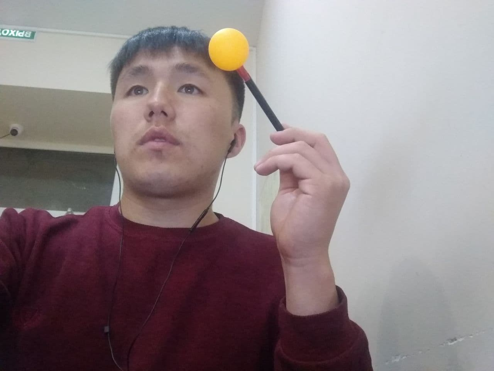
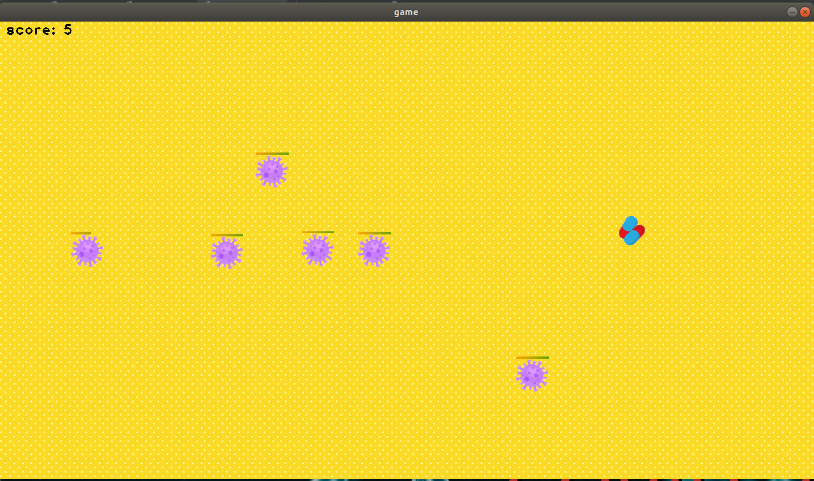
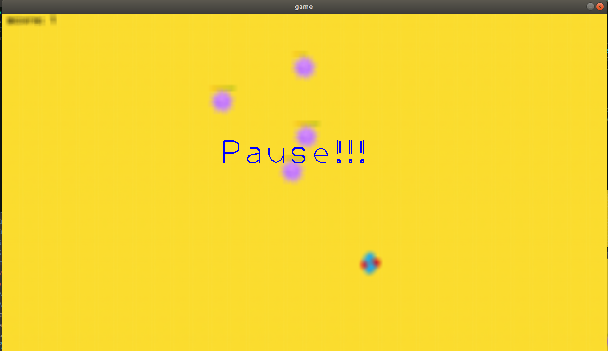
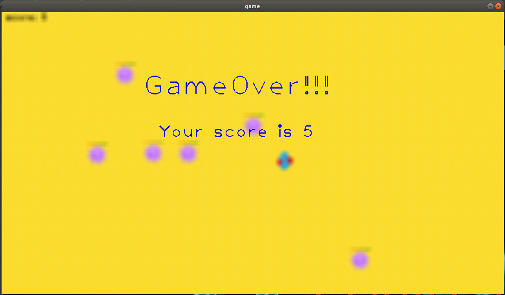
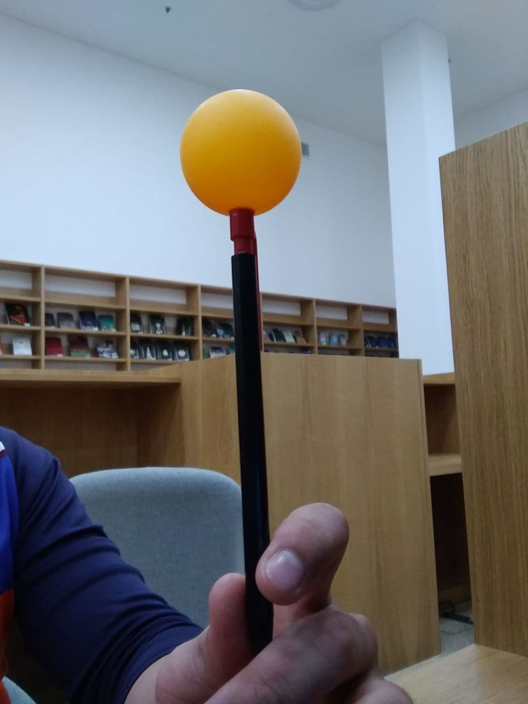

# COVID-2019


Hey yo, what's up! This is a small game called COVID-2019. To play and have fun with this game you only need c++11 and opencv (version 4.5.3) and just enjoy it.

## Run game
To run this game you simply need to do 3 steps:
On the root of the repository run
````cmake .````
it will creat Makefile, then do
````make```` and then your executable file raedy ````./opencv_project````

* [Video] (https://youtu.be/z6FG0wz3_Zg)




## How to play
To play game you need something like this:

It may be any color different of background. By default it orange like in image below. You can change simple run color_detection.cpp and set your color. Everything is very intuitively understandable


## Goal of this game
Kill all the viruses with your cheapest kinect

## Others
Your can pause the game by just simply pressing "p" button or finish the game with "esc" button.